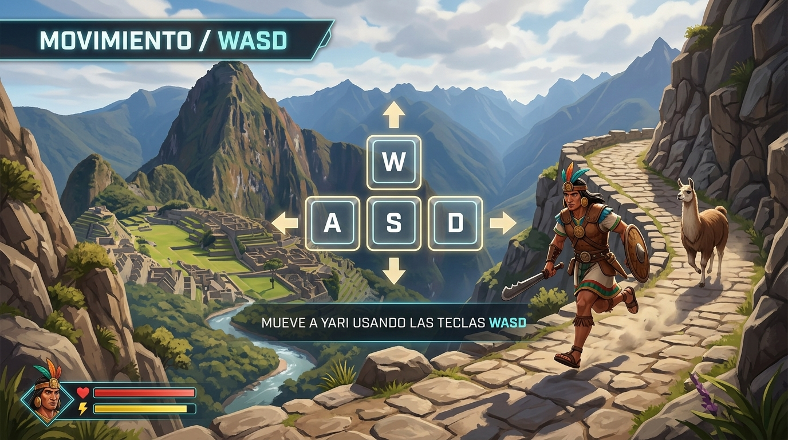
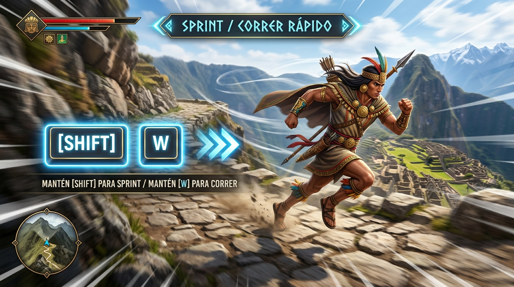
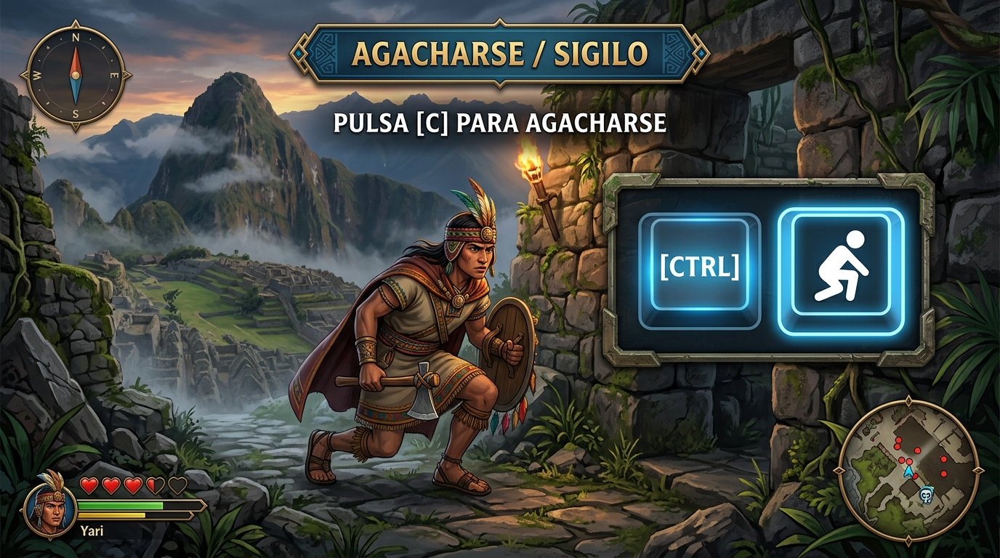
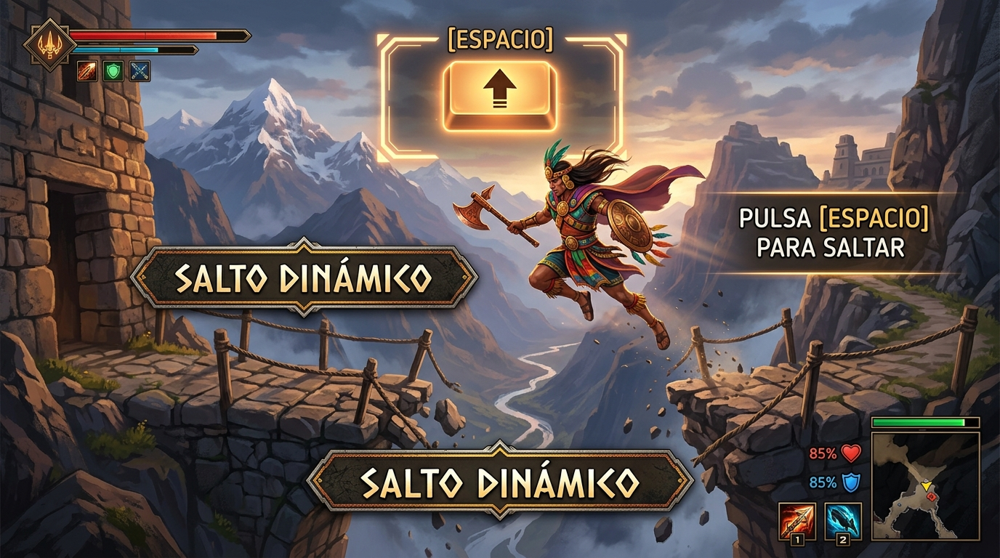
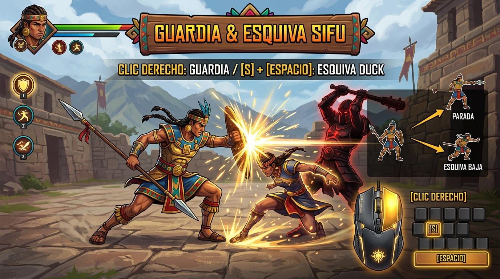
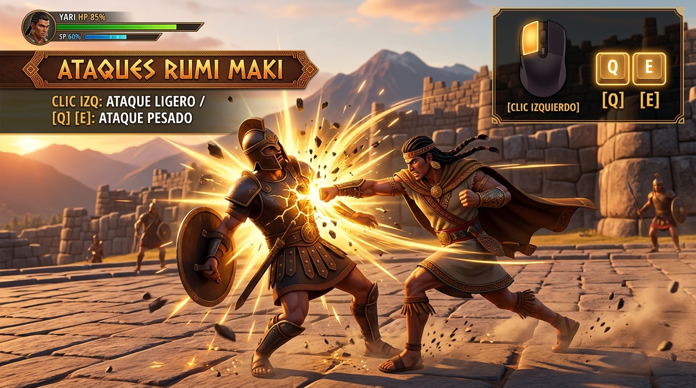

# 🎮 GUÍA VISUAL DE CONTROLES Y MOVIMIENTOS
# 🌄 AYNI: EL RETORNO DEL GUARDIÁN

> **Guía Oficial de Comportamiento y Asignación de Teclas (Teclado & Ratón y Mando de Xbox)**
>
> El HUD y el tutorial muestran solos los botones del dispositivo que estés usando: cambian al tocar el mando o el teclado.

## 🎮 Mando de Xbox (resumen)

| Acción | Mando de Xbox | Teclado y ratón |
| :--- | :--- | :--- |
| Moverse | Stick izquierdo (inclinarlo poco = caminar despacio) | `W` `A` `S` `D` |
| Cámara | Stick derecho | Ratón |
| Correr | Mantener `RT` (o pulsar el stick izquierdo, `L3`) | `Shift Izq.` |
| Saltar | `A` | `Espacio` |
| Agacharse | `B` (alternar) | `C` / `Ctrl Izq.` |
| Golpe ligero | `X` | `Clic Izq.` |
| Golpe pesado | `Y` | `Q` / `E` |
| Guardia (Yari se planta) | Mantener `LB` | Mantener `Clic Der.` / `G` |
| Guardia + agacharse (evita golpes altos) | `LB` + stick ↓ | Guardia + `S` |
| Guardia + saltito (evita barridos) | `LB` + stick ↑ (o `A`) | Guardia + `W` / `Espacio` |
| Guardia + balanceo (evita cualquier golpe) | `LB` + stick ← → | Guardia + `A` / `D` |
| Fijar rival | `RB` o `R3` | `Tab` / `Clic central` |
| Juicio Ayni: Venganza | `B` (botón rojo) | `F` |
| Juicio Ayni: Ayni (perdón) | `A` (botón verde) | `X` |
| Tutorial | `View` | `F1` |
| Saltar escena / tutorial · Reintentar | `Menu` | `Tab` / `Esc` · `R` |
| Mostrar u ocultar controles | Cruceta ↑ | `H` |
| Panel de prueba del mando | — | `F9` |

**Primera vez con el mando:** el menú `Ayni > Mando > Configurar Ejes del Mando Xbox` deja listos los ejes (ya vienen configurados en el repositorio). Para comprobar que Unity lee cada botón, entra en Play y pulsa `F9`.

---

## 1. Desplazamiento y Locomoción Básica: `[W] [A] [S] [D]`
Permite mover a Yari de forma tridimensional fluida con la cámara en tercera persona sobre el hombro. Cuando Yari no se mueve, adopta automáticamente su postura relajada natural con los brazos abajo.

- **Teclas:** `W` (Avanzar), `A` (Izquierda), `S` (Retroceder), `D` (Derecha).
- **Animación:** *Jog_Forward_InPlace* al avanzar; *Neutral_Idle* en reposo.

---

## 2. Sprint / Carrera Rápida: Mantener `[SHIFT IZQUIERDO]`
Permite acelerar el paso de Yari hasta `8.8 m/s` para cruzar grandes distancias, escapar de emboscadas o cerrar la distancia rápidamente contra un oponente.

- **Teclas:** Mantener `Shift Izquierdo` mientras te mueves con `W`.
- **Efecto:** Si estás agachado, iniciar sprint te pone de pie automáticamente.

---

## 3. Agacharse / Cuclillas y Sigilo: `[C]` / `[CTRL IZQUIERDO]`
Reduce la altura de la cápsula de colisión de Yari (de `2.0 m` a `1.15 m`), permitiendo pasar por debajo de arcos derruidos, vigas bajas y avanzar sigilosamente sin alertar a patrullas lejanas.

- **Teclas:** `C` (Alternar postura agachada) o `Ctrl Izquierdo` (Mantener).
- **Animación:** *Crouch_Idle* (cuclillas en espera) y *Crouch_Walk_InPlace* (caminar agachado).

---

## 4. Salto Dinámico: `[ESPACIO]`
Permite sortear desniveles, grietas en la calzada incaica y abismos entre puentes colgantes con impulso físico y aceleración por gravedad.

- **Tecla:** `Espacio` (cuando no estás en guardia).
- **Efecto:** Salto vertical en parábola con detección de suelo (`IsGrounded`).

---

## 5. Guardia Activa, Desvío (Parry) y Esquivas Sifu: `[CLIC DERECHO]` / `[LB]` + dirección
El pilar defensivo táctico del combate. Mantener la guardia reduce el daño recibido pero aumenta la barra de estructura propia. Desviar en el último milisegundo produce un **Parry perfecto**.

Como en *Sifu*, **en guardia Yari se planta y no camina**: solo gira para encarar al rival. La dirección ya no lo desplaza, solo elige la esquiva, y todas se hacen sin moverse del sitio. Tras esquivar o desviar, el siguiente golpe es un **contraataque** que daña mucho más la postura.

- **Guardia:** Mantener `Clic Derecho`, tecla `G` o `LB`.
- **Esquiva Duck (Agachada rápida bajo golpes altos, aviso rojo):** En guardia + `S` (stick ↓).
- **Esquiva Jump (Saltito sobre barridos bajos, aviso amarillo):** En guardia + `W` o `Espacio` (stick ↑ o `A`).
- **Balanceo lateral (evita cualquier golpe, con menos margen):** En guardia + `A` / `D` (stick ← →).
- Hay que volver a inclinar la dirección para encadenar otra esquiva (mantenerla pulsada no repite).

---

## 6. Artes Marciales Rumi Maki: `[CLIC IZQUIERDO]` & `[Q]` / `[E]`
El sistema ofensivo del "Puño de Piedra" incaico, combinando impactos rápidos para presionar y golpes pesados de rotura de postura.

- **Ataque Ligero (Puñetazo Rumi Maki):** `Clic Izquierdo` (combo rápido de puños y codazos).
- **Ataque Pesado (Patada Circular y Golpe Sísmico):** Tecla `Q` o `E` (alto daño a la postura del rival).
- **Juicio Ayni (al quebrar la postura enemiga):** Tecla `F` / `B` (Golpe Letal de Venganza) · Tecla `X` / `A` (Desarme y Purificación).
- **Jefes:** no mueren a golpes. Romperles la postura antes de su fase final solo los deja expuestos (los golpes duelen más); en la fase final (≤ 40 % de vida) la acción se congela a cámara lenta y se decide el **Juicio Ayni**.
