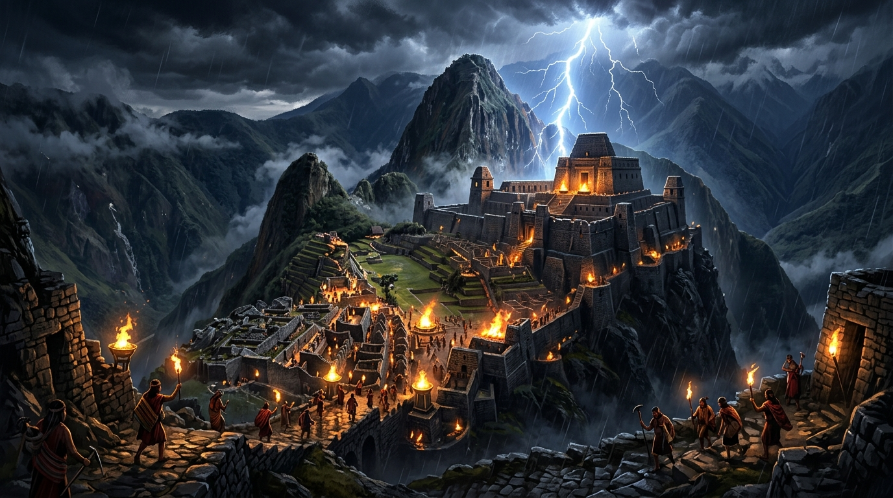
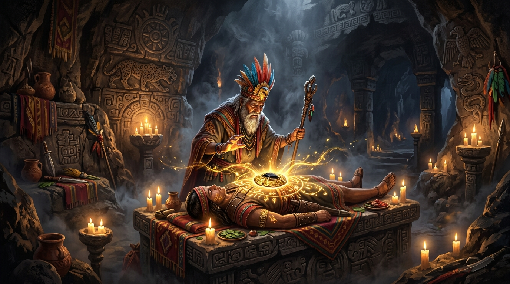
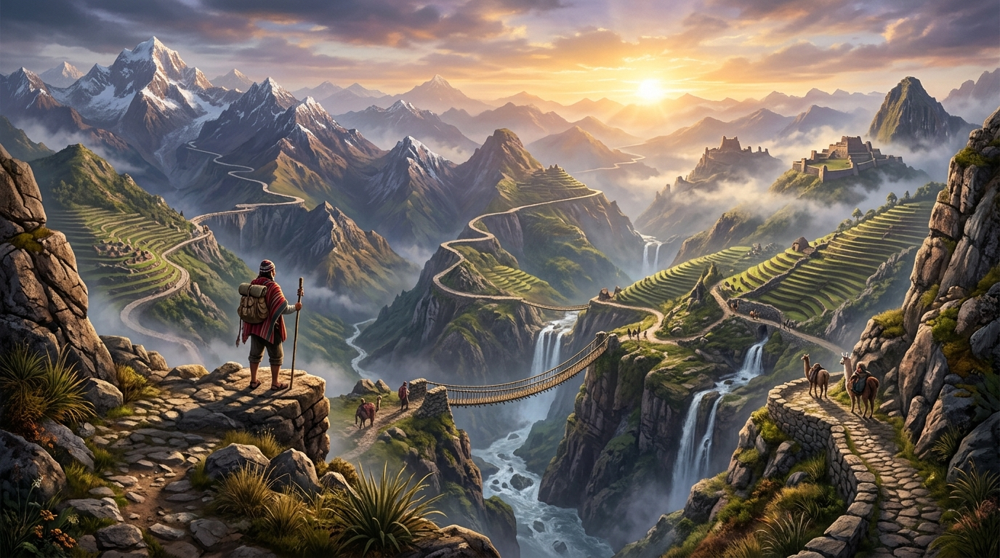
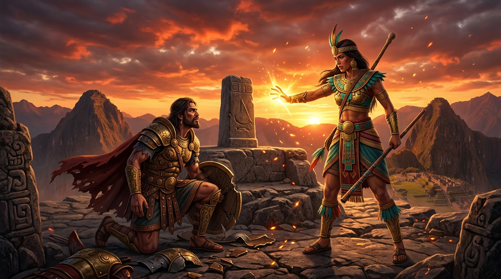
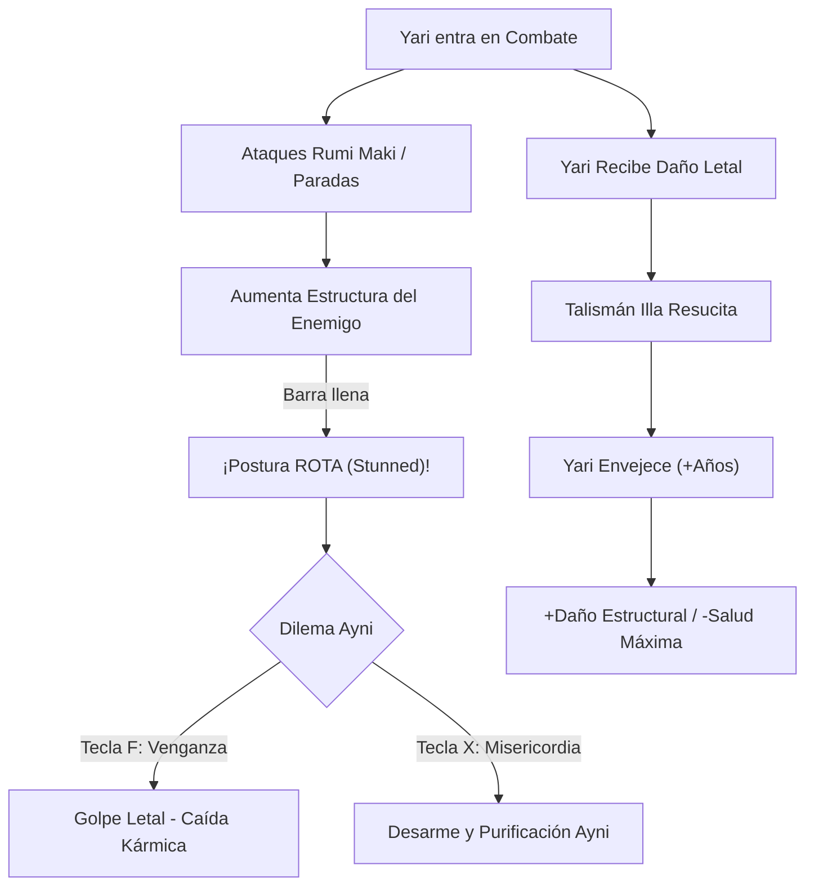
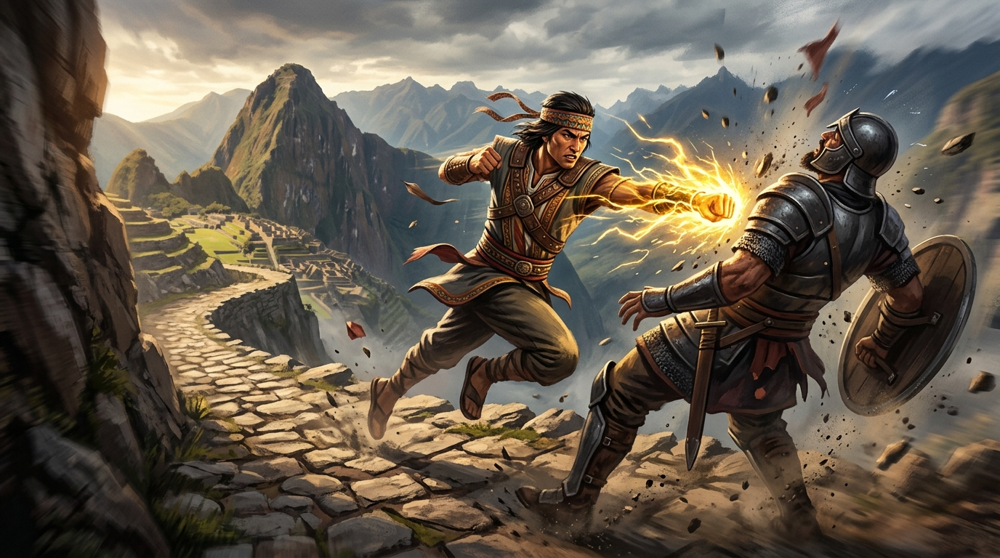
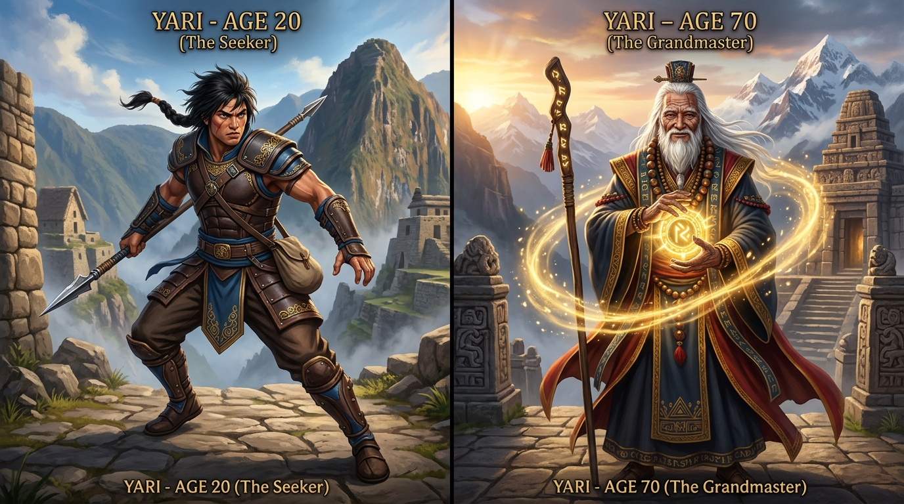
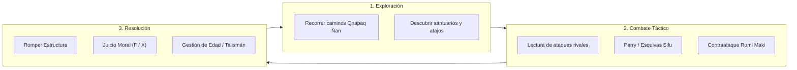

# 📜 GAME DESIGN DOCUMENT (GDD)
# 🌄 AYNI: EL RETORNO DEL GUARDIÁN

> **"Ayni":** *Principio andino sagrado de reciprocidad cósmica: "Hoy por ti, mañana por mí. Lo que tomas de la tierra y de tus hermanos, debes devolverlo en sagrada armonía."*

---

## 📌 FICHA TÉCNICA DEL PROYECTO

| Parámetro | Detalle |
| :--- | :--- |
| **Título del Proyecto** | **AYNI: El Retorno del Guardián** |
| **Género** | 3D Martial Arts Beat 'em up / Action RPG táctico |
| **Perspectiva** | Tercera persona sobre el hombro (*Close Over-The-Shoulder cinematic*) |
| **Inspiración de Combate** | *Sifu*, artes marciales andinas tradicionales (*Rumi Maki*) |
| **Motor & Gráficos** | Unity 6 (`6000.3.23f1`) con Universal Render Pipeline (URP) |
| **Plataformas Objetivo** | PC (Windows / Linux / Steam) y Consolas |
| **Público Objetivo** | Amantes de la acción técnica, beat 'em ups desafiantes y mitología andina |

---

## 📖 1. HISTORIA DEL JUEGO (NARRATIVA CORTA E ILUSTRADA)

### Prólogo: La Caída del Ayni y la Noche del Fuego

En las altas cumbres del Tawantinsuyu, los templos sagrados custodiaban el equilibrio entre los hombres, los Apus (espíritus tutelares de las montañas) y la Pachamama bajo la ley sagrada del **Ayni**. Sin embargo, la ambición corrompió al **General Sayri**, quien formó una camarilla de cuatro lugartenientes renegados para apoderarse de los recursos vitales del imperio.

En una noche de tempestad y fuego, el ejército usurpador asaltó la Ciudadela Sagrada, arrasó con la orden de los Guardianes del Sol y saqueó los tributos sagrados, sumiendo los valles en el hambre, la sequía y la opresión.

---

### El Despertar: El Talismán Sagrado "Illa"

Dado por muerto entre los escombros humeantes, el joven guardián **Yari** es rescatado por el anciano chamán de los Apus. Al borde de cruzar al *Uku Pacha* (el inframundo), el chamán inserta en el pecho de Yari el mítico **Talismán Illa**, forjado con oro sagrado y obsidiana solar.

El talismán otorga una bendición implacable: **Yari no morirá en batalla**, pues cada vez que caiga derrotado resucitará al instante con energía solar. No obstante, el tributo del Ayni es ineludible: **cada resurrección consume años de su juventud**, envejeciendo su cuerpo físico mientras concentra su sabiduría espiritual.

---

### La Travesía por el Qhapaq Ñan

Guiado por la sabiduría ancestral, Yari empuña el arte marcial del **Rumi Maki** (*Puño de Piedra*) y emprende una odisea a lo largo del **Qhapaq Ñan** (el Gran Camino Inca), cruzando gargantas profundas, puentes de cuerda colgantes y terrazas agrícolas para liberar a los pueblos subyugados y confrontar a los 5 usurpadores.

---

### El Clímax: El Juicio del Ayni en el Intihuatana

En la cima del nevado sagrado, junto al reloj solar del *Intihuatana*, Yari confronta al General Sayri. Al derrotar a sus enemigos y romper su postura, el jugador se enfrenta al dilema supremo: ¿ejecutar por venganza personal o perdonar bajo la ley del Ayni para purificar el cosmos?

---

## ⚙️ 2. MECÁNICAS PRINCIPALES DEL JUEGO

---

### A. Sistema de Estructura / Postura (*Posture Bar*)
Inspirado directamente en la precisión táctica de *Sifu* y *Sekiro*:
- Cada personaje posee dos barras: **Salud (HP)** y **Estructura (Postura)**.
- Bloquear pasivamente absorbe el golpe pero acumula daño de postura.
- **Desvío Perfecto (*Parry*):** Si se activa la guardia en la ventana de `0.22` segundos antes del impacto, Yari neutraliza el ataque, no recibe daño de postura y daña fuertemente la postura del agresor.
- **Rotura de Postura:** Al saturar la barra de postura del enemigo, este queda vulnerable a una acción de remate o juicio.

---

### B. Mecánica de Envejecimiento del Talismán "Illa"
- Yari comienza su viaje a los **20 años**.
- Cada vez que su barra de salud llega a cero, el talismán se activa y resucita a Yari en el mismo punto de la pelea.
- La primera muerte suma **+1 año**, la segunda **+2 años**, la tercera **+3 años**, incrementando el contador de muertes consecutivas.
- **Evolución del personaje por edad:**
  - **Juventud (20 - 35 años):** Máxima salud, resistencia a los golpes, gran velocidad de movimiento y esquiva ágil.
  - **Madurez (36 - 55 años):** Equilibrio perfecto; mayor potencia de golpes pesados Rumi Maki y mayor ventana de parry.
  - **Gran Maestro Anciano (56 - 75+ años):** Pelo blanco y aura solar mística. Su salud física es reducida (1-2 golpes pueden derribarlo), pero su poder místico causa daño de postura devastador y desbloquea técnicas secretas de los Apus.
  - **Límite de Vida (75+ años):** Si el talismán se rompe por exceso de edad, la partida termina (*Game Over*) y el jugador debe reintentar el capítulo con la edad con la que comenzó ese valle.

---

### C. El Dilema Moral: Venganza vs. Purificación (Ayni)
Al romper la estructura de cualquier jefe o líder usurpador:
1. **Ejecutar (Tecla F - Golpe Letal):**
   - Yari descarga su furia marcial acabando con el enemigo.
   - Satisface el camino de la venganza inmediata, pero corrompe el talismán y conduce al **Final Trágico**.
2. **Perdonar (Tecla X - Purificación Ayni):**
   - Yari desarma al rival con técnica no letal y lo obliga a arrodillarse y restituir los recursos al pueblo.
   - Purifica un año del talismán Illa y desbloquea el **Final Verdadero (Restauración del Tawantinsuyu)**.

---

## 🗺️ 3. ESTRUCTURA DE MISIONES Y JEFES

| Misión | Escenario Andino | Jefe Rival | Elemento Usurpado |
| :--- | :--- | :--- | :--- |
| **0. Prólogo** | Ciudadela Sagrada en Llamas | Capitán de Vanguardia | El Talismán Sagrado |
| **1. Valle de las Sombras** | Selva alta andina y ruinas cubiertas de musgo | **Amaru el Cazador** | Fauna sagrada y plumas ceremoniales |
| **2. Canteras de Piedra** | Minas de cobre y canteras megalíticas | **Túpac el Capataz de Bronce** | Herramientas y metales del pueblo |
| **3. Terrazas y Acueductos** | Andenes de cultivo y cascadas secas | **Apo Rumi el Acaparador** | Las aguas sagradas y canales de riego |
| **4. Palacio Alquímico** | Cámaras ceremoniales de transmutación | **Mama Churi la Alquimista** | El oro solar y las ofrendas rituales |
| **5. Cumbre del Intihuatana** | Cordillera nevada a 5,000 m.s.n.m. | **General Sayri el Usurpador** | El Trono y la Armonía Cósmica |

---

## 🎮 4. ESQUEMA COMPLETO DE CONTROLES

| Acción del Personaje | Teclado & Ratón (PC) | Mando (Xbox / PlayStation) | Descripción de Comportamiento |
| :--- | :--- | :--- | :--- |
| **Moverse (Trotar)** | `W`, `A`, `S`, `D` | Stick Izquierdo (L-Stick) | Desplazamiento relativo a la cámara en tercera persona |
| **Sprint / Carrera Rápida** | Mantener `Shift Izquierdo` | Mantener `L3` (presionar stick) | Yari corre a 8.8 m/s con animación de carrera rápida |
| **Agacharse / Modo Sigilo** | `C` (Alternar) / `Ctrl Izq` | `B` / `Círculo` | Reduce altura de colisión (1.15m); caminata agachada |
| **Salto Dinámico** | `Espacio` | `A` / `Cruz` | Salto vertical con física de gravedad e impulso |
| **Postura Relajada / Combate** | Automático | Automático | Brazos abajo en descanso; al combatir adopta guardia |
| **Guardia / Parada Activa** | Mantener `Clic Derecho` o `G` | Mantener `LB` / `L1` | Postura defensiva; desvío (*Parry*) en ventana de 0.22s |
| **Esquiva Sifu: Duck (Agachada)** | En Guardia + `S` o `Espacio` | En Guardia + Stick Abajo | Esquiva ágil bajo puñetazos altos y patadas |
| **Esquiva Sifu: Jump (Salto)** | En Guardia + `W` | En Guardia + Stick Arriba | Salto evasivo sobre barridos de piernas y golpes bajos |
| **Ataque Ligero Rumi Maki** | `Clic Izquierdo` | `X` / `Cuadrado` | Cadena rápida de puñetazos, golpes de palma y codazos |
| **Ataque Pesado Rumi Maki** | `Q` o `E` | `Y` / `Triángulo` | Patada circular y golpe de piedra de alto impacto |
| **Juicio: Golpe Letal (Venganza)**| `F` (con rival aturdido) | `RB` / `R1` | Ejecución final del enemigo con postura rota |
| **Juicio: Ayni (Misericordia)** | `X` (con rival aturdido) | `RT` / `R2` | Desarme, perdón y restitución de equilibrio sagrado |
| **Control de Cámara** | Movimiento del Ratón | Stick Derecho (R-Stick) | Órbita cinemática sobre el hombro |
| **Liberar Cursor / Pausa** | `Escape` | `Start` / `Options` | Muestra el cursor del sistema y abre el menú |

---

## 🔄 5. BUCLE DE JUGABILIDAD (*GAMEPLAY LOOP*)

### Características Clave de la Experiencia:
1. **Sensación de Impacto (*Game Feel*):** Cada puñetazo y patada de Rumi Maki posee micro-pausas de impacto (*hitstop*), partículas de piedra y polvo andino, y efectos sonoros de resonancia seca.
2. **Cámara Dinámica Cinemática:** La cámara se acerca en combates cerrados sobre el hombro de Yari y se amplía en espacios abiertos para apreciar los abismos y la cordillera de los Andes.
3. **Rejugabilidad y Maestría:** Completar el juego a una edad joven (con pocas o ninguna muerte) y perdonando a todos los jefes recompensa con el rango legendario de **"Sumak Kawsay" (Guardián del Buen Vivir)**.

---
*Documento de Diseño de Juego — Ayni: El Retorno del Guardián — Todos los derechos reservados.*
